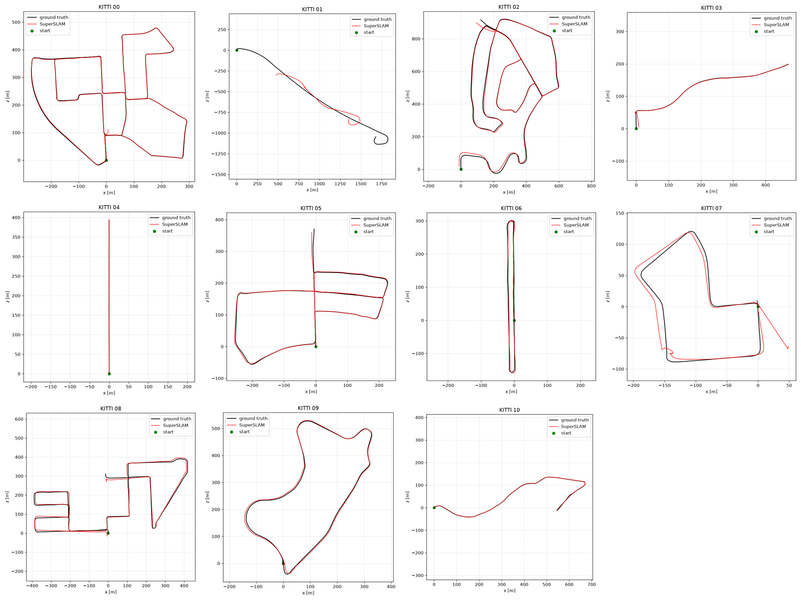
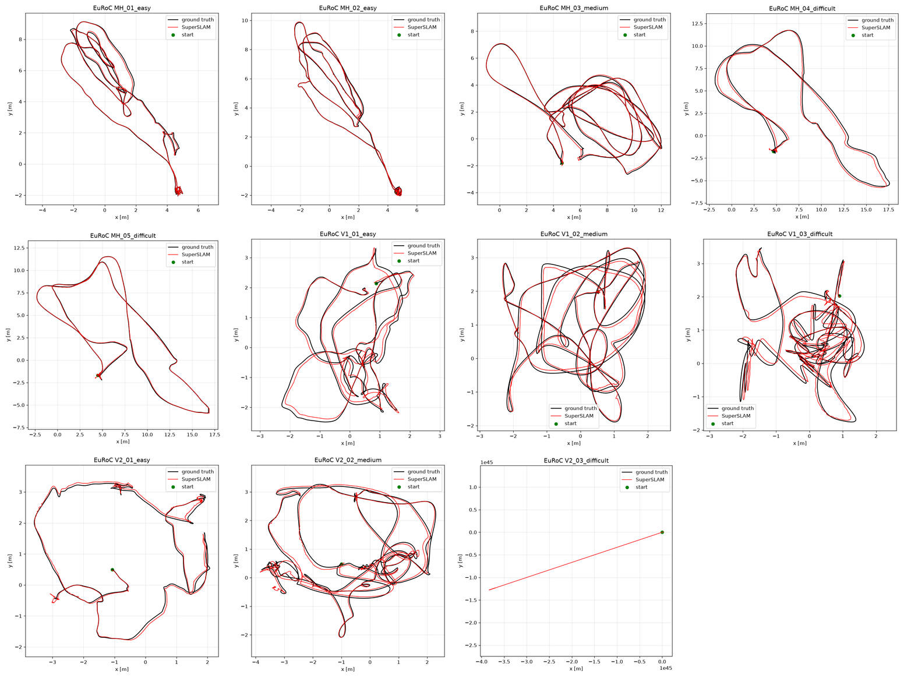
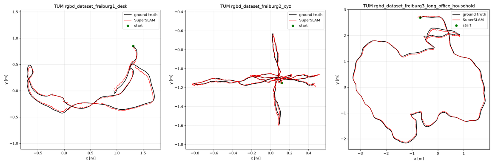
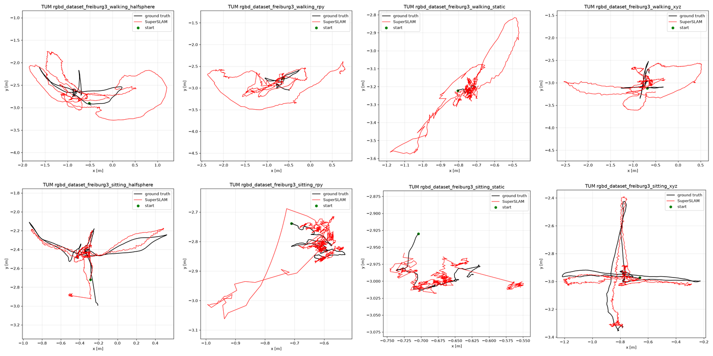
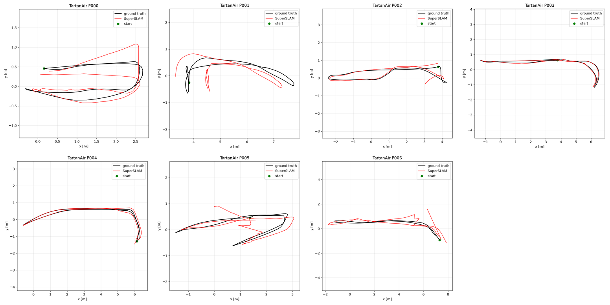
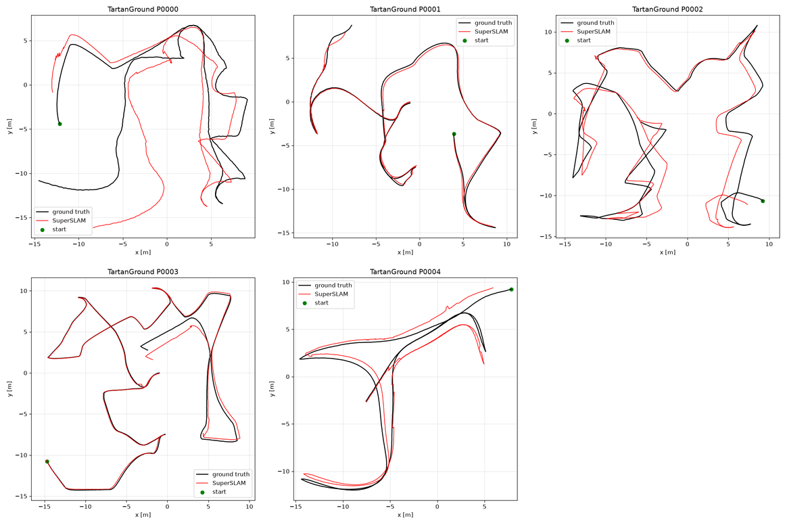

# Trajectory Plots

Estimated trajectory (red) against ground truth (black) for every benchmarked sequence. The numbers
are in the [README](README.md#results). KITTI is shown in the x-z ground plane.

## KITTI

## EuRoC

## TUM RGB-D

### Standard

### Dynamic

Top row walking, bottom row sitting.

## TartanAir

## TartanGround

